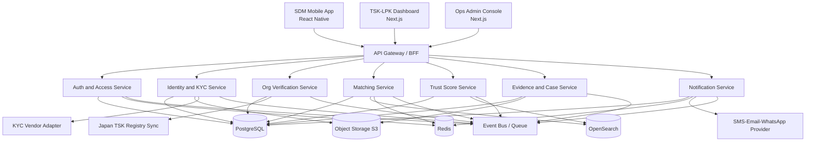
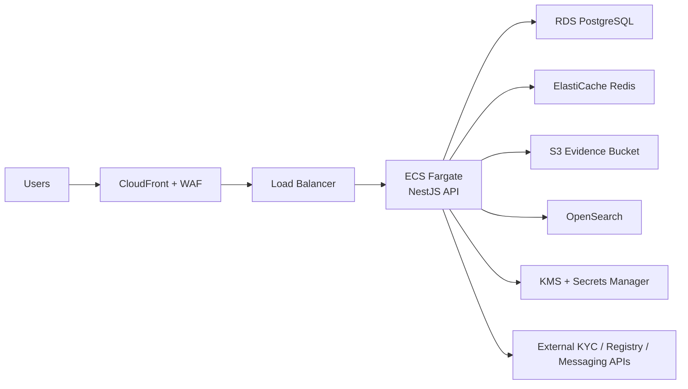
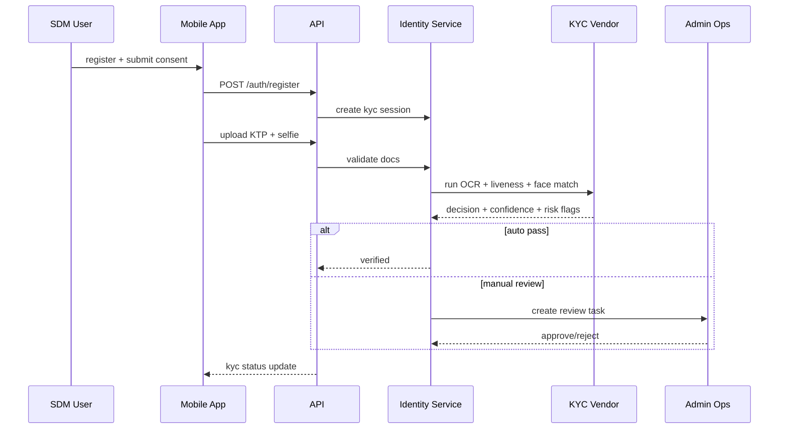
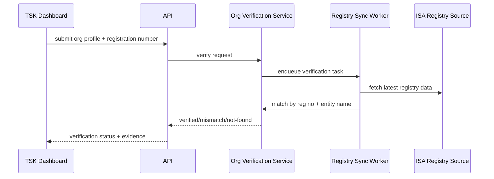
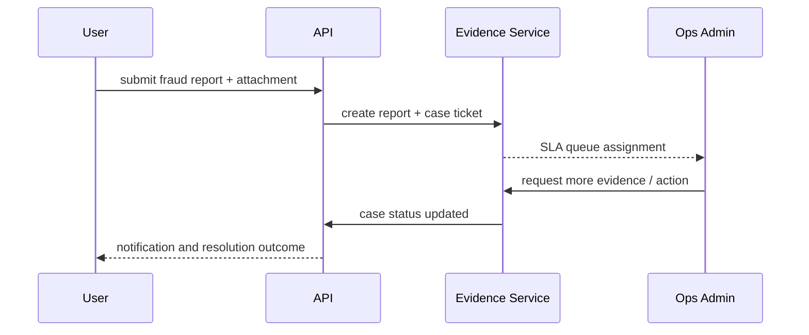
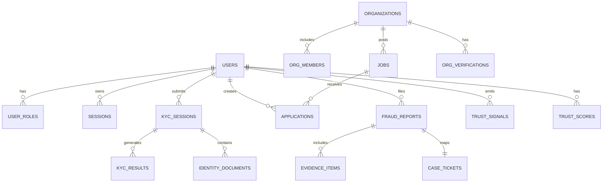

# SenpaiJepang - System Architecture Plan v1.0

## 1. Scope and Objective
- Build a trust-first migration platform for Indonesia to Japan.
- Deliver MVP 1.0 with anti-fraud core: identity verification, legal entity verification, safe matching, evidence/reporting.
- Support 3 surfaces: SDM app, TSK/LPK dashboard, internal Ops/Admin console.

## 2. Roles
- SDM: candidate user, onboarding, KYC, apply, report issues.
- TSK: registered support organization, post demand, review candidate, compliance upload.
- LPK: training institution, provide training data and candidate endorsement.
- Admin Ops: manual review, dispute handling, blacklist, policy actions.
- Compliance Officer: audit, policy changes, regulator-facing exports.

## 3. Architecture Principles
- Trust over growth: every key action is identity-bound and auditable.
- Explainable trust: no black-box score without reason codes.
- Compliance-by-design: explicit consent logs and data minimization.
- API-first platform: mobile/web/internal clients consume same contracts.
- Modular monolith for MVP, service split after product-market fit.

## 4. High-Level Architecture (HLD)

## 5. Deployment View

## 6. Service Boundaries and Responsibilities

| Service | Responsibilities | Core Tables | External Dependencies |
|---|---|---|---|
| Auth and Access | signup/login, session, RBAC/ABAC, MFA, token lifecycle | users, roles, sessions, otp_challenges | SMS/Email provider |
| Identity and KYC | KYC session orchestration, doc ingestion, selfie/face match, manual review routing | kyc_sessions, kyc_results, identity_documents | KYC vendors |
| Org Verification | TSK registry sync, registration cross-check, LPK legal docs validation | organizations, org_verifications, tsk_registry_entities | ISA registry data source |
| Matching | job posting, candidate filtering, apply workflow, eligibility checks | jobs, applications, candidate_profiles | OpenSearch |
| Trust Score | trust signals and score snapshot with reason codes | trust_signals, trust_scores, trust_score_factors | none |
| Evidence and Case | fraud report intake, case queue, dispute workflow, blacklist management | evidence_items, fraud_reports, case_tickets, blacklists | object storage |
| Notification | event-driven notifications, reminder and SLA alerts | notifications, templates | SMS/Email/Push provider |

## 7. Core Flows (LLD)

### 7.1 SDM Onboarding + KYC

### 7.2 TSK Verification Flow

### 7.3 Fraud Report and Case Handling

## 8. Data Architecture and ERD
- Canonical model is in `erd-v1.dbml`.
- Primary data store: PostgreSQL.
- Attachments and raw evidence: object storage.
- Search projection: OpenSearch index for jobs and verified organizations.
- Caching and short-lived session state: Redis.

### 8.1 ERD (Core Entities)

## 9. API Contract Strategy
- OpenAPI contract in `openapi-v1.yaml`.
- REST JSON for external/client APIs.
- Internal async events for side effects and SLA workflows.
- Versioning policy: `/v1` path version.

### 9.1 API Domains
- Auth: register/login/refresh/logout/MFA.
- Identity: start KYC, upload docs, fetch status.
- Organization Verification: submit/check verification, registry match.
- Matching: job listing, apply, application lifecycle.
- Trust: trust profile and factor explanation.
- Evidence: report fraud, upload evidence, case status.
- Admin: review queues, case actions, blacklist management.

### 9.2 Event Topics (Async)
- `user.kyc.submitted`
- `user.kyc.verified`
- `organization.verification.updated`
- `job.application.submitted`
- `fraud.report.created`
- `case.ticket.sla.breached`
- `trust.score.recomputed`

## 10. Security and Compliance Controls
- Encryption in transit (TLS 1.2+) and at rest (RDS/S3 encryption with KMS).
- Token model: short-lived access token + rotating refresh token.
- RBAC for baseline access and ABAC for case visibility (org scoped).
- PII segregation: sensitive fields in dedicated tables, least-privilege access.
- Immutable audit trail for critical actions: KYC decisions, verification changes, case outcomes.
- Consent ledger with versioned policy text and timestamp.
- Retention policy:
  - KYC artifacts: keep per legal minimum period.
  - Fraud evidence: retain until case closure + compliance window.
  - Right-to-delete workflow with legal hold exception.

## 11. Non-Functional Requirements (NFR)
- Availability target: 99.9% for core APIs.
- p95 latency target:
  - read APIs < 400 ms
  - write APIs < 700 ms
- Peak assumptions (MVP):
  - 100k registered users
  - 10k monthly active users
  - 1k concurrent sessions
- RTO: 4 hours, RPO: 15 minutes.
- Auditability: 100% critical events logged with actor and trace id.

## 12. Observability
- Structured logging with correlation id and user/org context.
- Metrics: API latency, queue lag, KYC pass rate, false-positive report rate, SLA breach count.
- Tracing: OpenTelemetry across API, workers, and external integrations.
- Alerting:
  - KYC vendor error rate > 5%
  - case queue backlog > threshold
  - registry sync failure > 1 cycle

## 13. Rollout Plan

### Phase 0 (Weeks 1-2)
- Finalize legal boundaries and data classification.
- Integrate 1 KYC provider sandbox.
- Build auth, user, org primitives.

### Phase 1 (Weeks 3-6)
- Ship SDM onboarding + KYC + consent ledger.
- Ship TSK basic dashboard and org verification.
- Add registry sync worker and admin review queue.

### Phase 2 (Weeks 7-10)
- Ship jobs, applications, and matching filters.
- Ship trust profile and score factors.
- Ship fraud report and case ticket lifecycle.

### Phase 3 (Weeks 11-14)
- Hardening, security testing, reliability improvements.
- Add SLA alerting and compliance exports.
- Pilot launch to limited sectors and prefectures.

## 14. Definition of Done for MVP 1.0
- SDM can register, pass KYC, and submit verified applications.
- TSK can pass verification, post jobs, and manage applicants.
- Users can submit fraud reports with evidence and track case status.
- All critical actions are auditable and explainable.
- Core trust metrics and anti-fraud KPIs available in ops dashboard.

## 15. Scale-Up Companion
- For post-MVP scale planning and quality-first governance, use:
  - `SCALABLE-QUALITY-BUSINESS-PLAN-v1.md`
- This companion document defines scale gates, engineering quality model, business unit-economics guardrails, and 24-month roadmap.
