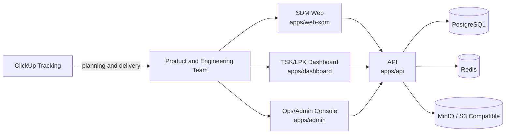
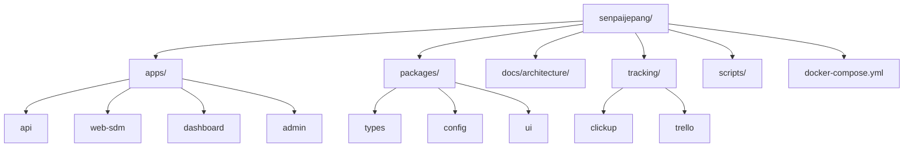
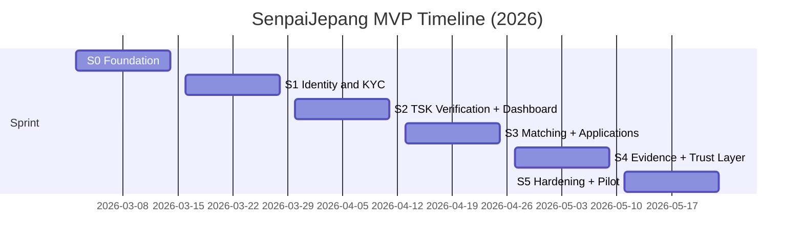

# SenpaiJepang MVP Monorepo

Trust-first platform untuk verified migration infrastructure Indonesia -> Jepang.

Product thesis:
- Trust > Growth
- Quality > Quantity
- Critical consent, not passive consent

## Product Scope (Current Repository)
This repository currently contains MVP foundation only:
- Monorepo structure for API + 3 web surfaces.
- Local infrastructure stack for development (PostgreSQL, Redis, MinIO).
- CI baseline (lint, typecheck, test).
- Architecture, product, and sprint planning docs.
- ClickUp/Trello provisioning scripts for delivery tracking.

Not yet implemented in this codebase:
- Full production-grade KYC provider integration and review workflow.
- Production-grade database schema and migrations.
- TG matching engine and anti-fraud case workflow.
- Native mobile apps.

Implemented now:
- Auth skeleton in API (`register`, `login`, `refresh`, `logout`, `me`).
- Auth store adapters: `in-memory` and `postgres`.
- RBAC skeleton (`roles`, `user_roles`, default role assignment on register).
- KYC session skeleton in API (`create session`, `status`).
- KYC document ingestion skeleton + admin review + status audit events.
- Observability baseline (`/metrics`, `x-request-id`, structured JSON logs).
- Sprint 0 quality gates: SAST scan, secret scan, OpenAPI/versioning checks.

## Auth Skeleton Endpoints (Current)
- `GET /health`
- `GET /metrics`
- `POST /auth/register`
  body: `{ "fullName": "...", "email": "...", "password": "min8chars" }`
- `POST /auth/login`
  body: `{ "identifier": "email", "password": "..." }`
- `POST /auth/refresh`
  body: `{ "refreshToken": "..." }`
- `POST /auth/logout`
  body: `{ "refreshToken": "..." }`
- `GET /auth/me`
  header: `Authorization: Bearer <accessToken>`

## Identity/KYC Skeleton Endpoints (Current)
- `POST /identity/kyc/sessions`
  header: `Authorization: Bearer <accessToken>`
  body: `{ "provider": "manual|sumsub|..." }` (`provider` optional, default `manual`)
- `POST /identity/kyc/sessions/{sessionId}/submit`
  header: `Authorization: Bearer <accessToken>`
  submit uploaded KYC documents for review.
- `POST /identity/kyc/sessions/{sessionId}/provider-metadata`
  header: `Authorization: Bearer <accessToken>`
  body: `{ "providerRef"?: "...", "metadata"?: {...} }`
- `GET /identity/kyc/status`
  header: `Authorization: Bearer <accessToken>`
  response status enum: `NOT_STARTED | IN_PROGRESS | MANUAL_REVIEW | VERIFIED | REJECTED`
- `POST /identity/kyc/upload-url`
  header: `Authorization: Bearer <accessToken>`
  body: `{ "sessionId"?: "uuid", "documentType": "KTP|PASSPORT|...", "fileName": "ktp.jpg", "contentType": "image/jpeg|image/png|application/pdf", "contentLength": 512000, "checksumSha256": "64hex" }`
- `POST /identity/kyc/documents`
  header: `Authorization: Bearer <accessToken>`
  body: `{ "sessionId"?: "uuid", "documentType": "KTP|PASSPORT|...", "objectKey": "kyc/<user>/<session>/...", "checksumSha256": "64hex", "metadata"?: {...} }`
- `GET /identity/kyc/history?sessionId=<uuid>`
  header: `Authorization: Bearer <accessToken>`
  returns KYC status transition audit trail for user-owned session.
- `POST /identity/kyc/provider-webhook`
  headers: `x-kyc-webhook-secret`, `x-idempotency-key`
  provider webhook stub endpoint (secret + idempotency validation + metadata hook).

KYC upload sequence:
1. call `POST /identity/kyc/upload-url`
2. upload file with returned `uploadUrl` + required headers
3. call `POST /identity/kyc/documents` with `objectKey`
4. optional hook `POST /identity/kyc/sessions/{sessionId}/provider-metadata`
5. call `POST /identity/kyc/sessions/{sessionId}/submit`

## Admin KYC Endpoint (Current)
- `POST /admin/kyc/review`
  header: `x-admin-api-key: <ADMIN_API_KEY>`
  body: `{ "sessionId": "uuid", "decision": "MANUAL_REVIEW|VERIFIED|REJECTED", "reviewedBy": "ops@...", "reason"?: "..." }`
- `GET /admin/kyc/review-queue?status=DEFAULT|ALL|SUBMITTED|MANUAL_REVIEW|VERIFIED|REJECTED|CREATED&limit=1..100`
  header: `x-admin-api-key: <ADMIN_API_KEY>`
  returns queue items with user summary, document list, risk flags, and status events.

## Visual Overview
### 1) System Context


### 2) Repository Map


### 3) MVP Sprint Timeline (Reference)


## Monorepo Layout
- `apps/api`:
  backend API starter (`/health` endpoint + test).
- `apps/web-sdm`:
  SDM web starter (mobile-web first placeholder).
- `apps/dashboard`:
  TSK/LPK dashboard starter.
- `apps/admin`:
  Ops/admin console starter.
- `packages/types`:
  shared domain constants/types placeholder.
- `packages/config`:
  shared runtime config placeholder.
- `packages/ui`:
  shared UI/brand constants placeholder.
- `docs/architecture`:
  architecture, planning, API/ERD artifacts.
- `tracking/clickup`:
  primary delivery tracking templates/docs.
- `tracking/trello`:
  fallback tracking templates/docs.
- `scripts`:
  tooling scripts for tracking setup and repo checks.

## Runtime Surfaces and Ports
- API: `http://localhost:4000`
- SDM Web: `http://localhost:3000`
- Dashboard: `http://localhost:3001`
- Admin: `http://localhost:3002`
- PostgreSQL: `localhost:5432`
- Redis: `localhost:6379`
- MinIO API: `http://localhost:9000`
- MinIO Console: `http://localhost:9001`

## Prerequisites
- Node.js `>=22`
- npm `>=11`
- Docker Desktop (or Docker Engine with Compose)
- Git

## First-Time Setup
Fast path (start everything with one command after install):
```bash
cd /path/to/senpaijepang
cp .env.example .env
npm install
npm run dev:all
```

Stop all services:
```bash
npm run stop:all
```

1. Clone and enter repo.
2. Copy environment file.
3. Install dependencies.
4. Start local infrastructure.

```bash
cd /path/to/senpaijepang
cp .env.example .env
npm install
docker compose up -d
```

Optional (recommended for backend work):
5. Run auth database migration.

```bash
npm run migrate:api
```

6. Switch API auth store to postgres.

```bash
# in .env
AUTH_STORE=postgres
```

## Development Commands (Root)
- `npm run ci`
  run lint + typecheck + test + security/openapi checks.
- `npm run lint`
  run workspace lint checks.
- `npm run typecheck`
  run workspace type checks (currently placeholder for non-API apps).
- `npm run test`
  run workspace tests.
- `npm run ci:security`
  run SAST + secret scan + OpenAPI contract checks.
- `npm run scan:sast`
  run lightweight static security checks on `apps/*` and `packages/*`.
- `npm run scan:secrets`
  scan tracked files for potential leaked credentials.
- `npm run check:openapi`
  validate OpenAPI runtime/target specs + Sprint 1 freeze policy.
- `npm run check:dev-all`
  start all local services via orchestrator, probe health endpoints, then stop all services.
- `npm run smoke:api`
  run endpoint smoke flow against already-running API.
  default target is `http://localhost:4000` and can be overridden via `SMOKE_BASE_URL`.
- `npm run smoke:local`
  full local smoke (docker compose + migration + start API postgres/s3 + endpoint checks).
  default uses isolated Postgres host port `55432` to avoid clashing with local PostgreSQL.
  override with `SMOKE_POSTGRES_PORT` or full `SMOKE_DATABASE_URL` when needed.
- `npm run dev:all`
  start docker infra and all app surfaces in background (`api`, `web-sdm`, `dashboard`, `admin`).
  runtime state/logs are stored under `.dev-runtime/`.
- `npm run stop:all`
  stop all services started by `dev:all` and stop docker compose services.
- `npm run dev:api`
  start API in watch mode.
- `npm run dev:web-sdm`
  start SDM static app.
- `npm run dev:dashboard`
  start dashboard static app.
- `npm run dev:admin`
  start admin static app.
- `npm run migrate:api`
  run PostgreSQL migrations for API (`apps/api/migrations`).
- `npm run deploy:staging`
  one-command staging bootstrap (quality gates + infra up + migration).

## Quick Smoke Check
1. Start API:
```bash
npm run dev:api
```
2. In another terminal:
```bash
curl -s http://localhost:4000/health
```
Expected response:
```json
{"status":"ok","service":"api","version":"0.1.0"}
```

## Environment Variables
Use `.env.example` as source of truth.

- `API_PORT`
  API port (default `4000`).
- `AUTH_STORE`
  auth storage backend: `memory` or `postgres` (default `memory`).
- `AUTH_TOKEN_SECRET`
  HMAC secret for access token signing.
- `AUTH_ACCESS_TOKEN_TTL_SEC`
  access token TTL in seconds (default `900`).
- `AUTH_REFRESH_TOKEN_TTL_SEC`
  refresh token TTL in seconds (default `604800`).
- `AUTH_DEFAULT_ROLE_CODE`
  default role assigned to newly registered users (default `sdm`).
- `DB_POOL_MAX`
  PostgreSQL pool size for API when `AUTH_STORE=postgres`.
- `ADMIN_API_KEY`
  shared key for admin review endpoints (`POST /admin/kyc/review`).
- `KYC_PROVIDER_WEBHOOK_SECRET`
  shared secret for `POST /identity/kyc/provider-webhook` (empty = disabled).
- `KYC_PROVIDER_WEBHOOK_IDEMPOTENCY_TTL_SEC`
  idempotency key retention window for webhook dedupe (default `86400`).
- `LOG_LEVEL`
  structured log level (`debug|info|warn|error`), default `info`.
- `POSTGRES_DB`
  database name.
- `POSTGRES_USER`
  database user.
- `POSTGRES_PASSWORD`
  database password.
- `POSTGRES_PORT`
  PostgreSQL port (default `5432`).
- `DATABASE_URL`
  full Postgres connection string.
- `REDIS_PORT`
  Redis port (default `6379`).
- `REDIS_URL`
  Redis connection string.
- `MINIO_PORT`
  MinIO S3 API port (default `9000`).
- `MINIO_CONSOLE_PORT`
  MinIO web console port (default `9001`).
- `MINIO_ROOT_USER`
  MinIO root user.
- `MINIO_ROOT_PASSWORD`
  MinIO root password.
- `OBJECT_STORAGE_PROVIDER`
  storage adapter mode: `memory` (default) or `s3`.
- `OBJECT_STORAGE_BUCKET`
  object bucket name for KYC files.
- `OBJECT_STORAGE_REGION`
  region for S3 signing.
- `OBJECT_STORAGE_ENDPOINT`
  S3-compatible endpoint, e.g. `http://localhost:9000` for MinIO.
- `OBJECT_STORAGE_ACCESS_KEY_ID`
  access key for object storage.
- `OBJECT_STORAGE_SECRET_ACCESS_KEY`
  secret key for object storage.
- `OBJECT_STORAGE_FORCE_PATH_STYLE`
  set `true` for MinIO/local S3-compatible endpoint.
- `OBJECT_STORAGE_PRESIGN_EXPIRES_SEC`
  pre-signed URL lifetime in seconds.
- `OBJECT_STORAGE_MAX_FILE_BYTES`
  max upload size accepted by API validation.
- `OBJECT_STORAGE_ALLOWED_CONTENT_TYPES`
  comma-separated whitelist for upload content types.

## CI
GitHub Actions workflow:
- file: `.github/workflows/ci.yml`
- trigger: push to `main`, pull requests.
- checks:
  - `npm ci`
  - `npm run lint`
  - `npm run typecheck`
  - `npm run test`
  - `npm run scan:sast`
  - `npm run scan:secrets`
  - `npm run check:openapi`

## Architecture and Product Documents
Recommended reading order:
1. `docs/architecture/ARCHITECTURE-HLD-LLD-v1.md`
2. `docs/architecture/SCALABLE-QUALITY-BUSINESS-PLAN-v1.md`
3. `docs/architecture/MVP-SPRINT-PLAN-v1.md`
4. `docs/architecture/API-IMPLEMENTATION-STATUS-v0.md`
5. `docs/architecture/openapi-runtime-v0.yaml`
6. `docs/architecture/erd-v1.dbml`
7. `docs/architecture/openapi-v1.yaml`
8. `docs/architecture/sprint1-contract-freeze.json`

## Delivery Tracking
Primary tracking is ClickUp:
- setup guide: `tracking/clickup/README.md`
- workspace template: `tracking/clickup/mvp-workspace-template.json`
- bulk owner/due assignment sample: `tracking/clickup/sprint-owners-due.sample.json`

Fallback tracking is Trello:
- setup guide: `tracking/trello/README.md`

## Contribution Workflow
- Branch from `main` for each task.
- Keep commits small and imperative.
- Run `npm run ci` before commit/push.
- Open PR with:
  - problem and scope,
  - testing proof,
  - risk/rollback note.

## Security and Compliance Notes
- Do not commit secrets or real production credentials.
- Keep `.env` local only.
- Regenerate any leaked API token immediately.
- For migration/legal-sensitive features, align implementation with docs in `docs/architecture` before shipping.

## Current Baseline Status
- Repo initialized and pushed to `main`.
- Workspace scaffolding done.
- Local infra compose file available.
- Sprint 0 engineering foundation done in-repo:
  - CI + security + OpenAPI quality gates
  - RBAC baseline and default role assignment
  - observability baseline (logs/metrics/request-id)
  - staging bootstrap command
- Sprint 1 API baseline active:
  - auth + KYC + admin review queue
  - explicit KYC submit endpoint (`/identity/kyc/sessions/{sessionId}/submit`)
  - provider metadata hook + provider webhook stub
  - KYC audit trail status transitions
