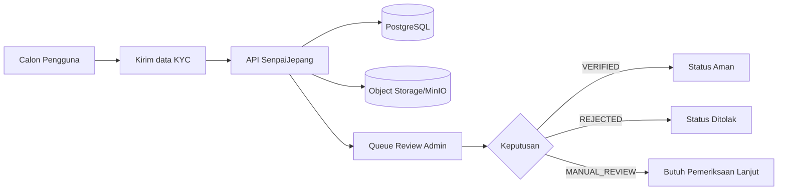
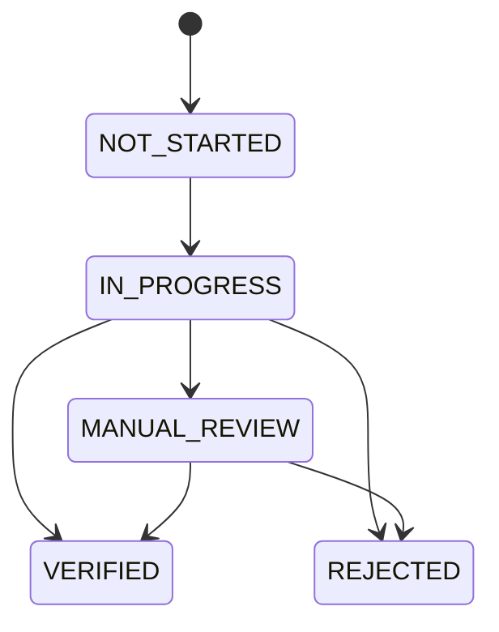

# SenpaiJepang API MVP

Repo ini adalah "mesin belakang" (backend API) untuk proses verifikasi trust di platform migrasi kerja Indonesia -> Jepang.

Frontend user/admin sengaja belum dikerjakan di repo ini. Fokus kita sekarang: API stabil dulu.

## Ringkas Dalam 30 Detik
- Apa yang sudah jalan: auth, KYC intake, review queue admin, audit event.
- Apa yang belum: aplikasi web/mobile production, payment, integrasi vendor KYC penuh.
- Siapa yang bisa pakai sekarang: tim backend, QA, PM/ops untuk validasi alur via API.

## Gambaran Besar (Non-Tech)


## Status KYC Yang Dipakai


## Apa Yang Sudah Bisa Didemokan
- Register -> login -> refresh -> logout.
- Buka sesi KYC, minta upload URL, submit dokumen, submit sesi.
- Admin ambil review queue dan putuskan `MANUAL_REVIEW`, `VERIFIED`, atau `REJECTED`.
- Audit trail perubahan status KYC.
- Endpoint health/metrics untuk observability dasar.

## Apa Yang Belum Dalam Scope Repo Ini
- Aplikasi frontend user/admin production.
- Integrasi vendor KYC end-to-end (signature verification vendor-specific).
- Payment/escrow dan workflow bisnis lintas negara.

## Cara Menjalankan (Paling Simpel)
### Prasyarat
- Node.js `>=22`
- npm `>=10`
- Docker Desktop aktif

### Langkah
```bash
cd /path/to/senpaijepang
cp .env.example .env
npm install
docker compose up -d
npm run migrate:api
npm run dev:api
```

### Cek Berhasil
```bash
curl -fsS http://localhost:4000/health
```
Expected output:
```json
{"status":"ok","service":"api","version":"0.1.0"}
```

### Cek Orkestrasi Full Local
```bash
npm run check:dev-all
```
Expected output akhir: `DEV_ALL_CHECK_OK`

## Command Harian
| Command | Untuk apa |
|---|---|
| `npm run dev:api` | Nyalain API mode development |
| `npm run dev:all` | Nyalain infra + API sekalian |
| `npm run stop:all` | Matikan service hasil `dev:all` |
| `npm run migrate:api` | Jalankan migration database |
| `npm run test` | Jalankan test |
| `npm run test:ios -w @senpaijepang/mobile-ios` | Jalankan unit test scaffold iOS |
| `npm run ci` | Gate utama lint + typecheck + test + security checks |
| `npm run smoke:local` | Simulasi smoke test lokal end-to-end |

## API Yang Aktif Sekarang
### Base
- `GET /health`
- `GET /metrics`

### Auth
- `POST /auth/register`
- `POST /auth/login`
- `POST /auth/refresh`
- `POST /auth/logout`
- `GET /auth/me`

### Jobs
- `GET /jobs`
- `GET /jobs/{jobId}`
- `POST /jobs/{jobId}/applications`
- `GET /users/me/saved-jobs`
- `POST /users/me/saved-jobs`
- `DELETE /users/me/saved-jobs/{jobId}`
- `GET /users/me/applications`
- `GET /users/me/applications/{applicationId}/journey`

### Feed
- `GET /feed/posts`
- `GET /users/me/saved-posts`
- `POST /users/me/saved-posts`
- `DELETE /users/me/saved-posts/{postId}`

### Profile
- `GET /users/me/profile`
- `PATCH /users/me/profile`
- `GET /users/me/verification-documents`
- `POST /users/me/verification/final-request`

### Identity/KYC
- `POST /identity/kyc/sessions`
- `POST /identity/kyc/sessions/{sessionId}/submit`
- `POST /identity/kyc/sessions/{sessionId}/provider-metadata`
- `GET /identity/kyc/status`
- `POST /identity/kyc/upload-url`
- `POST /identity/kyc/documents`
- `GET /identity/kyc/history?sessionId=<uuid>`
- `POST /identity/kyc/provider-webhook`

### Admin Review
- `GET /admin/kyc/review-queue`
- `POST /admin/kyc/review`

## Environment Penting
- `API_PORT=4000`
- `AUTH_STORE=memory|postgres`
- `DATABASE_URL=postgresql://...` (wajib kalau `AUTH_STORE=postgres`)
- `ADMIN_API_KEY=...` (wajib untuk endpoint `/admin/*`)
- `OBJECT_STORAGE_PROVIDER=memory|s3`

Detail lengkap: `.env.example`

## Mulai Baca Dokumen Dari Sini
- [Execution Lock: API First -> iOS Later](docs/architecture/EXECUTION-LOCK-API-FIRST-v1.md)
- [Panduan Non-Tech MVP API](docs/architecture/MVP-API-NON-TECH-GUIDE-v1.md)
- [iOS Architecture (MVVM + Clean tanpa UseCase)](docs/architecture/IOS-ARCHITECTURE-MVVM-CLEAN-v1.md)
- [API Plan from Figma (Draft)](docs/architecture/API-PLAN-FIGMA-v1.md)
- [API Plan from Stitch Screens](docs/architecture/API-PLAN-STITCH-SCREENS-v1.md)
- [Breakdown Fitur MVP API](docs/architecture/MVP-API-BREAKDOWN-v1.md)
- [Status Implementasi Runtime API](docs/architecture/API-IMPLEMENTATION-STATUS-v0.md)
- [Kontrak Runtime OpenAPI](docs/architecture/openapi-runtime-v0.yaml)
- [Sprint Plan Lama (Archived)](docs/architecture/MVP-SPRINT-PLAN-v1.md)

## Istilah Singkat Biar Nyambung
- **KYC**: verifikasi identitas pengguna.
- **Review Queue**: daftar kasus yang menunggu keputusan admin.
- **MANUAL_REVIEW**: butuh pengecekan manusia lanjutan.
- **VERIFIED**: lolos verifikasi.
- **REJECTED**: ditolak.
