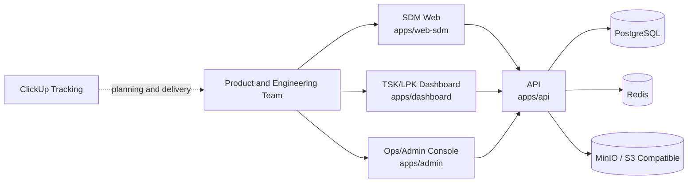
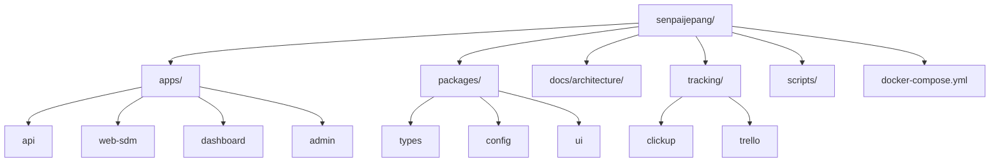
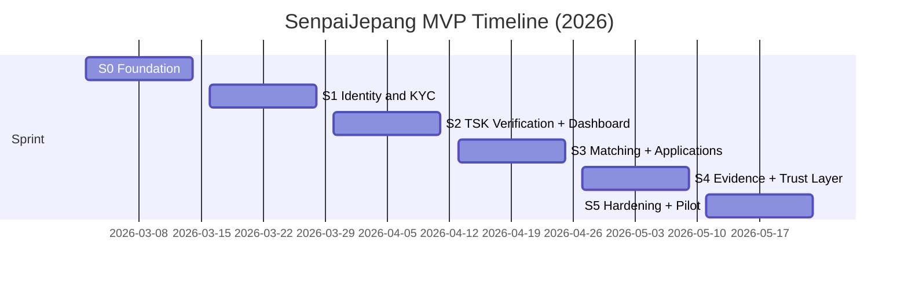

# SenpaiJepang MVP Monorepo

Trust-first platform untuk verified migration infrastructure Indonesia -> Jepang.

Product thesis:
- Trust > Growth
- Quality > Quantity
- Critical consent, not passive consent

## Product Scope (Current Repository)
This repository currently contains MVP foundation only:
- Monorepo structure for API + 3 web surfaces.
- Local infrastructure stack for development (PostgreSQL, Redis, MinIO).
- CI baseline (lint, typecheck, test).
- Architecture, product, and sprint planning docs.
- ClickUp/Trello provisioning scripts for delivery tracking.

Not yet implemented in this codebase:
- Full auth/KYC flow.
- Production-grade database schema and migrations.
- TG matching engine and anti-fraud case workflow.
- Native mobile apps.

## Visual Overview
### 1) System Context


### 2) Repository Map


### 3) MVP Sprint Timeline (Reference)


## Monorepo Layout
- `apps/api`:
  backend API starter (`/health` endpoint + test).
- `apps/web-sdm`:
  SDM web starter (mobile-web first placeholder).
- `apps/dashboard`:
  TSK/LPK dashboard starter.
- `apps/admin`:
  Ops/admin console starter.
- `packages/types`:
  shared domain constants/types placeholder.
- `packages/config`:
  shared runtime config placeholder.
- `packages/ui`:
  shared UI/brand constants placeholder.
- `docs/architecture`:
  architecture, planning, API/ERD artifacts.
- `tracking/clickup`:
  primary delivery tracking templates/docs.
- `tracking/trello`:
  fallback tracking templates/docs.
- `scripts`:
  tooling scripts for tracking setup and repo checks.

## Runtime Surfaces and Ports
- API: `http://localhost:4000`
- SDM Web: `http://localhost:3000`
- Dashboard: `http://localhost:3001`
- Admin: `http://localhost:3002`
- PostgreSQL: `localhost:5432`
- Redis: `localhost:6379`
- MinIO API: `http://localhost:9000`
- MinIO Console: `http://localhost:9001`

## Prerequisites
- Node.js `>=22`
- npm `>=11`
- Docker Desktop (or Docker Engine with Compose)
- Git

## First-Time Setup
1. Clone and enter repo.
2. Copy environment file.
3. Install dependencies.
4. Start local infrastructure.

```bash
cd /path/to/senpaijepang
cp .env.example .env
npm install
docker compose up -d
```

## Development Commands (Root)
- `npm run ci`
  run lint + typecheck + test for all workspaces.
- `npm run lint`
  run workspace lint checks.
- `npm run typecheck`
  run workspace type checks (currently placeholder for non-API apps).
- `npm run test`
  run workspace tests.
- `npm run dev:api`
  start API in watch mode.
- `npm run dev:web-sdm`
  start SDM static app.
- `npm run dev:dashboard`
  start dashboard static app.
- `npm run dev:admin`
  start admin static app.

## Quick Smoke Check
1. Start API:
```bash
npm run dev:api
```
2. In another terminal:
```bash
curl -s http://localhost:4000/health
```
Expected response:
```json
{"status":"ok","service":"api","version":"0.1.0"}
```

## Environment Variables
Use `.env.example` as source of truth.

- `API_PORT`
  API port (default `4000`).
- `POSTGRES_DB`
  database name.
- `POSTGRES_USER`
  database user.
- `POSTGRES_PASSWORD`
  database password.
- `POSTGRES_PORT`
  PostgreSQL port (default `5432`).
- `DATABASE_URL`
  full Postgres connection string.
- `REDIS_PORT`
  Redis port (default `6379`).
- `REDIS_URL`
  Redis connection string.
- `MINIO_PORT`
  MinIO S3 API port (default `9000`).
- `MINIO_CONSOLE_PORT`
  MinIO web console port (default `9001`).
- `MINIO_ROOT_USER`
  MinIO root user.
- `MINIO_ROOT_PASSWORD`
  MinIO root password.

## CI
GitHub Actions workflow:
- file: `.github/workflows/ci.yml`
- trigger: push to `main`, pull requests.
- checks:
  - `npm ci`
  - `npm run lint`
  - `npm run typecheck`
  - `npm run test`

## Architecture and Product Documents
Recommended reading order:
1. `docs/architecture/ARCHITECTURE-HLD-LLD-v1.md`
2. `docs/architecture/SCALABLE-QUALITY-BUSINESS-PLAN-v1.md`
3. `docs/architecture/MVP-SPRINT-PLAN-v1.md`
4. `docs/architecture/erd-v1.dbml`
5. `docs/architecture/openapi-v1.yaml`

## Delivery Tracking
Primary tracking is ClickUp:
- setup guide: `tracking/clickup/README.md`
- workspace template: `tracking/clickup/mvp-workspace-template.json`
- bulk owner/due assignment sample: `tracking/clickup/sprint-owners-due.sample.json`

Fallback tracking is Trello:
- setup guide: `tracking/trello/README.md`

## Contribution Workflow
- Branch from `main` for each task.
- Keep commits small and imperative.
- Run `npm run ci` before commit/push.
- Open PR with:
  - problem and scope,
  - testing proof,
  - risk/rollback note.

## Security and Compliance Notes
- Do not commit secrets or real production credentials.
- Keep `.env` local only.
- Regenerate any leaked API token immediately.
- For migration/legal-sensitive features, align implementation with docs in `docs/architecture` before shipping.

## Current Baseline Status
- Repo initialized and pushed to `main`.
- Workspace scaffolding done.
- Local infra compose file available.
- API health endpoint test passing.
