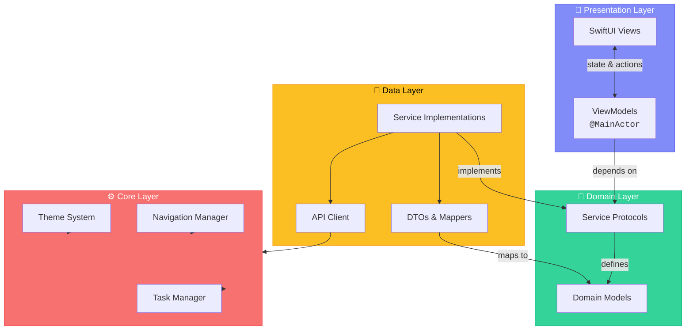
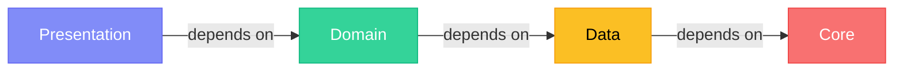
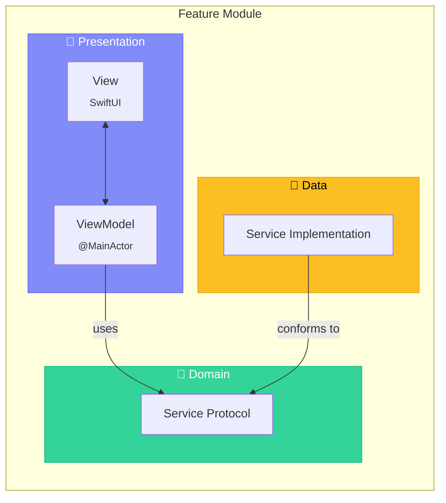
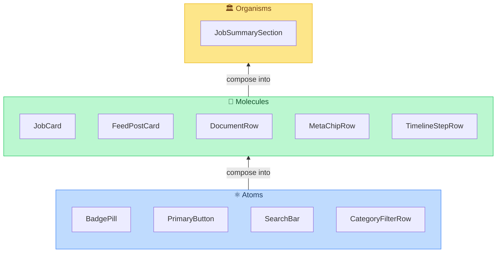
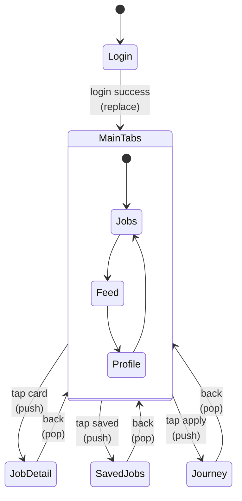
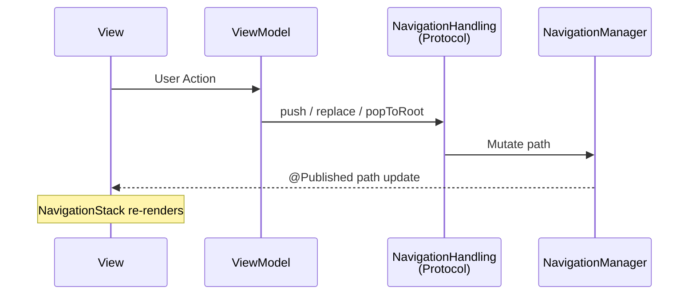
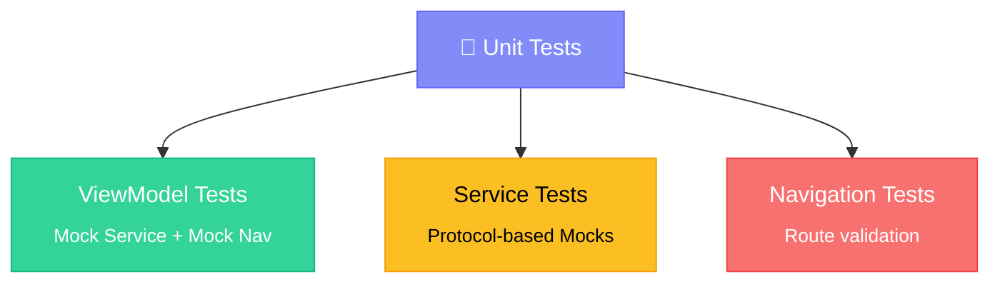
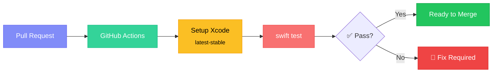
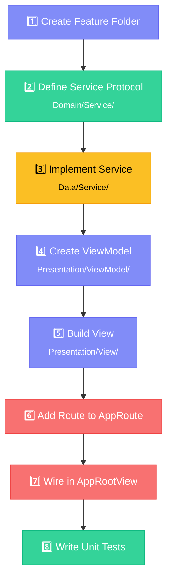

<p align="center">
  
  
  
  
  
</p>

<h1 align="center">
  🇯🇵 SenpaiJepang iOS
</h1>

<p align="center">
  <strong>Your gateway to working in Japan — built with modern Swift & SwiftUI.</strong>
  <br />
  <sub>MVVM · Clean Architecture · Atomic Design · NavigationStack</sub>
</p>

---

## 📖 Table of Contents

- [Overview](#-overview)
- [Architecture](#-architecture)
- [Project Structure](#-project-structure)
- [Feature Modules](#-feature-modules)
- [Component Library (Atomic Design)](#-component-library-atomic-design)
- [Navigation System](#-navigation-system)
- [Tech Stack](#-tech-stack)
- [Getting Started](#-getting-started)
- [Testing](#-testing)
- [CI/CD](#-cicd)
- [Contributing](#-contributing)

---

## 🌏 Overview

**SenpaiJepang** is a native iOS application that helps job seekers discover, apply for, and track employment opportunities in Japan. The app provides a seamless experience for browsing job listings, managing application journeys, building professional profiles, and engaging with community feeds.

### Key Features

| Feature | Description |
|---------|-------------|
| 🔐 **Authentication** | Login, registration, and session restore |
| 💼 **Job Discovery** | Browse, search, filter, and save job listings |
| 🗺️ **Application Journey** | Apply to jobs and track your application timeline |
| 👤 **Profile** | Build your professional profile and verification status |
| 📰 **Feed** | Community posts, tips, and saved content |

---

## 🏗️ Architecture

The project follows a **MVVM + Clean Architecture** pattern (without UseCase layer for MVP simplicity) combined with **Atomic Design** for reusable UI components.

### High-Level Architecture



### Dependency Rule



> **📌 Why no UseCase layer?**
> For MVP, UseCase is intentionally skipped to keep the flow fast and file count minimal.
> Domain logic stays clean in Service + Protocol. When cross-domain complexity grows,
> use cases can be introduced incrementally.

---

## 📁 Project Structure

```
apps/mobile-ios/
├── 📦 Package.swift                    # SPM manifest (SenpaiMobileCore library)
├── 📋 project.yml                      # XcodeGen project spec
├── 📱 SenpaiJepang.xcodeproj/          # Generated Xcode project
├── 📄 Info.plist                       # App configuration
│
├── Sources/
│   ├── SenpaiJepangApp/                # 🎯 iOS App Target
│   │   ├── SenpaiJepangApp.swift       #    App entry point (@main)
│   │   ├── App/
│   │   │   ├── AppRootView.swift       #    Root NavigationStack wiring
│   │   │   └── MainTabView.swift       #    Tab bar controller
│   │   ├── Core/
│   │   │   ├── Navigation/             #    🧭 AppRoute, NavigationManager
│   │   │   ├── Task/                   #    ⏳ ManagedTask async helper
│   │   │   └── Theme/                  #    🎨 AppTheme design tokens
│   │   ├── Components/
│   │   │   ├── Atoms/                  #    ⚛️  Smallest UI building blocks
│   │   │   ├── Molecules/              #    🧬 Composed UI patterns
│   │   │   └── Organisms/              #    🏛️  Screen-ready sections
│   │   └── Features/
│   │       ├── Auth/                   #    🔐 Login flow
│   │       ├── Jobs/                   #    💼 Job discovery & bookmarks
│   │       ├── Journey/                #    🗺️  Application tracking
│   │       ├── Profile/                #    👤 User profile
│   │       └── Feed/                   #    📰 Community feed
│   │
│   └── SenpaiMobileCore/              # 📚 Shared Core Library
│       └── (mirrors App structure)     #    Reusable across targets
│
└── Tests/
    └── SenpaiMobileCoreTests/          # ✅ Unit tests
        ├── LoginViewModelTests.swift
        └── NavigationManagerTests.swift
```

---

## 🧩 Feature Modules

Each feature follows a consistent **Clean Architecture** structure:



### Feature Breakdown

| Module | Views | ViewModels | Service Protocol | Service Impl |
|--------|-------|------------|-----------------|--------------|
| **Auth** | `LoginView` | `LoginViewModel` | `AuthServiceProtocol` | `AuthService` |
| **Jobs** | `JobsListView` · `JobDetailView` · `SavedJobsView` | `JobsListViewModel` · `JobDetailViewModel` · `SavedJobsViewModel` | `JobServiceProtocol` | `JobService` |
| **Journey** | `ApplicationJourneyView` | `ApplicationJourneyViewModel` | `JourneyServiceProtocol` | `JourneyService` |
| **Profile** | `ProfileView` | `ProfileViewModel` | `ProfileServiceProtocol` | `ProfileService` |
| **Feed** | `FeedListView` | `FeedListViewModel` | `FeedServiceProtocol` | `FeedService` |

---

## 🎨 Component Library (Atomic Design)

The UI component library follows **Atomic Design** principles for maximum reusability.



### Design Rules

- 🚫 **No API calls** from Atoms, Molecules, or Organisms
- 🎨 **Consistent styling** via `Core/Theme/AppTheme`
- ♻️ **Cross-feature** — components are shared, not duplicated

---

## 🧭 Navigation System

Centralized navigation powered by `NavigationStack` and a single `NavigationManager` as the source of truth.



### App Routes

```swift
enum AppRoute: Hashable {
    case login
    case jobsList
    case jobDetail(jobId: String)
    case savedJobs
    case profile
    case applicationJourney(applicationId: String)
}
```

### Navigation Architecture



> ViewModels use the `NavigationHandling` protocol for testability —
> they never depend on `NavigationManager` directly.

---

## ⚡ Tech Stack

| Category | Technology | Version |
|----------|-----------|---------|
| Language | Swift | 6.0 |
| UI Framework | SwiftUI | 4.0+ |
| Min Deployment | iOS | 17.0 |
| Architecture | MVVM + Clean | — |
| UI Pattern | Atomic Design | — |
| Navigation | NavigationStack | — |
| Package Manager | Swift Package Manager | — |
| Project Gen | XcodeGen | latest |
| IDE | Xcode | 16.2+ |
| Concurrency | Swift Concurrency | `@MainActor` / `async-await` |

---

## 🚀 Getting Started

### Prerequisites

- macOS with **Xcode 16.2+** installed
- Node.js/NPM *(only if running via monorepo workspace)*

### Run in Xcode

```bash
# Open the project
open SenpaiJepang.xcodeproj

# Then in Xcode:
# 1. Select scheme "SenpaiJepang"
# 2. Pick an iOS Simulator
# 3. Press ⌘R
```

### Build from CLI

```bash
xcodebuild \
  -project SenpaiJepang.xcodeproj \
  -scheme SenpaiJepang \
  -destination 'generic/platform=iOS Simulator' \
  build
```

### Regenerate Project (after `project.yml` changes)

```bash
# Install XcodeGen if needed
brew install xcodegen

# Regenerate
xcodegen generate --spec project.yml
```

---

## ✅ Testing

### Run Unit Tests

```bash
# Via Swift Package Manager
swift test --package-path .

# Via monorepo workspace
npm run test:ios -w @senpaijepang/mobile-ios
```

### Test Coverage

| Module | Tests |
|--------|-------|
| `NavigationManager` | ✅ Route push/pop/replace |
| `LoginViewModel` | ✅ Login flow, validation, navigation |

### Testing Strategy



> ⚠️ **Known Limitation:** `swift test` may fail on macOS due to iOS-only
> `ToolbarItemPlacement` values (`.topBarLeading`, `.topBarTrailing`).
> For stable validation, use Xcode Simulator builds.

---

## 🔄 CI/CD

### Continuous Integration



| Config | Value |
|--------|-------|
| Workflow | `.github/workflows/ios-ci.yml` |
| Runner | `macos-latest` |
| Xcode | `latest-stable` (via `maxim-lobanov/setup-xcode`) |

### Deployment (Next Phase)

TestFlight build & release pipeline will be configured after:
- Bundle ID, signing, and provisioning are finalized
- API reaches Release Candidate milestone

---

## 🤝 Contributing

### Code Conventions

1. **ViewModel** must depend on **protocols**, never concrete services
2. All reusable UI goes into `Components/Atoms|Molecules|Organisms`
3. No `UseCase` layer in MVP — domain logic stays in Services
4. All navigation actions go through `NavigationHandling` protocol
5. `@MainActor` on all ViewModels for thread safety

### Adding a New Feature



---

## 📋 Version Policy

| Policy | Value |
|--------|-------|
| iOS Deployment Target | `N-2` from latest iOS major |
| Xcode | Latest stable |
| Swift Package Platform | iOS 17+ / macOS 15+ |

---

## 📚 Further Reading

- [iOS Architecture MVVM Clean v1](../../docs/architecture/IOS-ARCHITECTURE-MVVM-CLEAN-v1.md)

---

<p align="center">
  <sub>Built with ❤️ by the SenpaiJepang Team</sub>
  <br />
  <sub>Swift 6.0 · SwiftUI · MVVM Clean Architecture · Atomic Design</sub>
</p>
