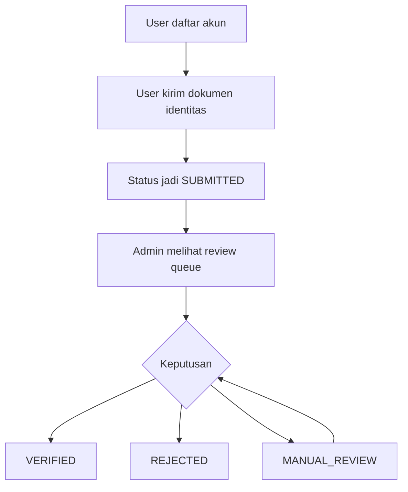

# MVP API Non-Tech Guide v1

Date: 2026-03-01
Audience: PM, Ops, Compliance, Stakeholder non-engineering

## 1. Dokumen Ini Untuk Apa?
Dokumen ini menjelaskan kemampuan produk saat ini dalam bahasa bisnis, bukan bahasa kode.

Tujuan utama MVP saat ini:
- Membuat proses verifikasi identitas yang bisa diaudit.
- Memastikan ada jalur review manual untuk keputusan berisiko.
- Menjaga tim bisa memonitor kesehatan sistem secara dasar.
- Menyiapkan kontrak API stabil untuk integrasi iOS bertahap.

## 2. Alur Bisnis Sederhana

## 3. Nilai Bisnis Yang Sudah Didapat
- Ada jejak keputusan: siapa review, kapan review, dan alasannya.
- Proses verifikasi tidak blind: ada state/status yang jelas.
- Tim teknis punya endpoint health + metrics untuk operasional dasar.

## 4. Hal Yang Bisa Diuji PM/Ops Hari Ini
- User bisa register/login.
- User bisa submit KYC.
- Admin bisa ambil daftar antrean review.
- Admin bisa memberi keputusan dan melihat dampaknya pada status.
- User bisa lihat jobs/feed, save item, apply, dan cek journey aplikasi.
- Admin bisa kelola jobs/feed serta verifikasi organisasi.

## 5. Batasan MVP Saat Ini
- Belum ada UI production untuk user/admin di repo ini.
- Integrasi vendor KYC belum sampai orkestrasi penuh per provider (retry/reconciliation detail).
- Shared key admin masih tersedia sebagai fallback bootstrap, walau model role-token sudah aktif.
- Belum ada staging publik permanen untuk integration test lintas tim.

## 6. Definisi “Siap Demo Internal”
Sistem dianggap siap demo internal jika:
- `npm run ci` pass
- `npm run check:dev-all` pass
- alur KYC dari create session sampai review decision bisa dijalankan
- flow jobs/feed/profile untuk user login berjalan tanpa blocker P0/P1

## 7. Risiko Yang Perlu Dipahami Non-Tech
- Jika Docker tidak jalan, environment lokal terlihat “down” walau kode benar.
- Jika role admin tidak valid dan `ADMIN_API_KEY` tidak diset, endpoint admin ditolak (expected).
- Jika object storage tidak siap, alur upload dokumen bisa gagal.
- Jika contract runtime berubah tanpa sinkronisasi app iOS, integrasi bisa regress.

## 8. Dokumen Lanjutan
- Breakdown teknis: `docs/architecture/MVP-API-BREAKDOWN-v1.md`
- Status implementasi detail: `docs/architecture/API-IMPLEMENTATION-STATUS-v0.md`
- Kontrak endpoint: `docs/architecture/openapi-runtime-v0.yaml`
- Execution lock terbaru: `docs/architecture/EXECUTION-LOCK-API-FIRST-v1.md`
- Opsi hosting staging MVP: `docs/architecture/HOSTING-OPTIONS-MVP-v1.md`
